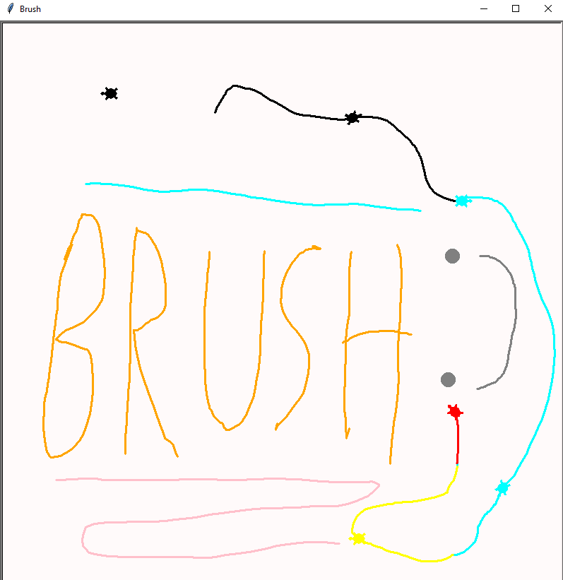

# Brush
Simple drawing app made by me :D
---------------------------------------
How to use:
- Drag the mouse with 'Left Click' to draw.
- Use 'ARROWS' to draw straight lines.
- 'Middle Click' to change colors.
- 'Right Click' to clear.
- Press 'S' to stamp.
- Press 'T' to change background color.
- Press 'K' to change the shape of the brush.

## Screenshot:
  
